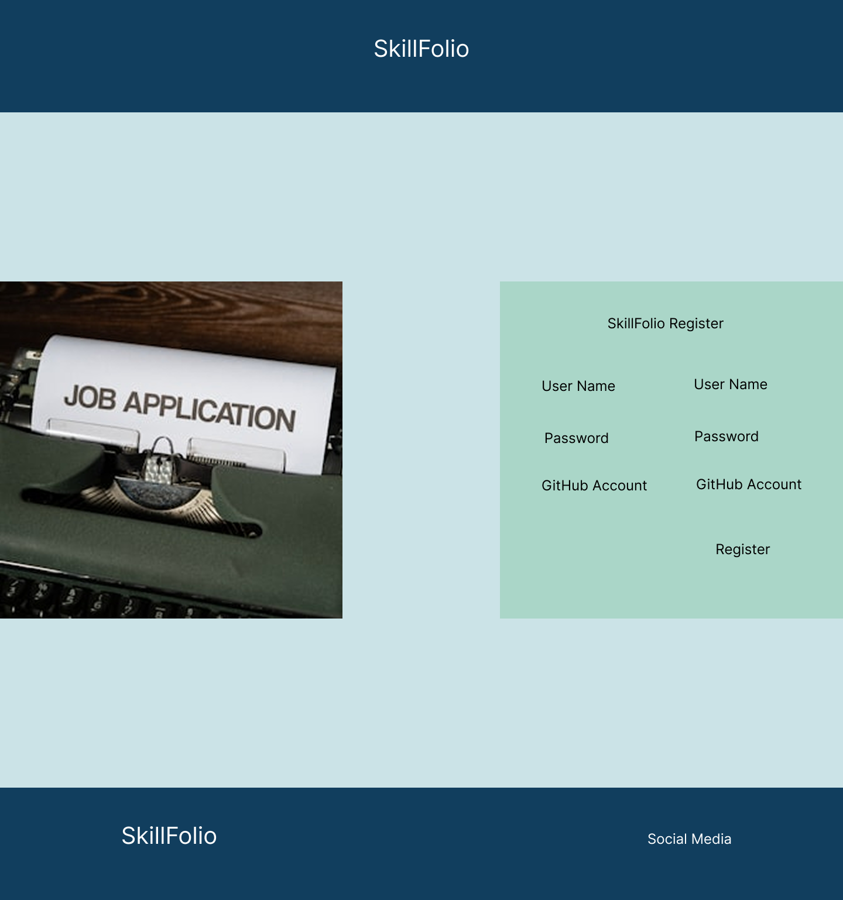
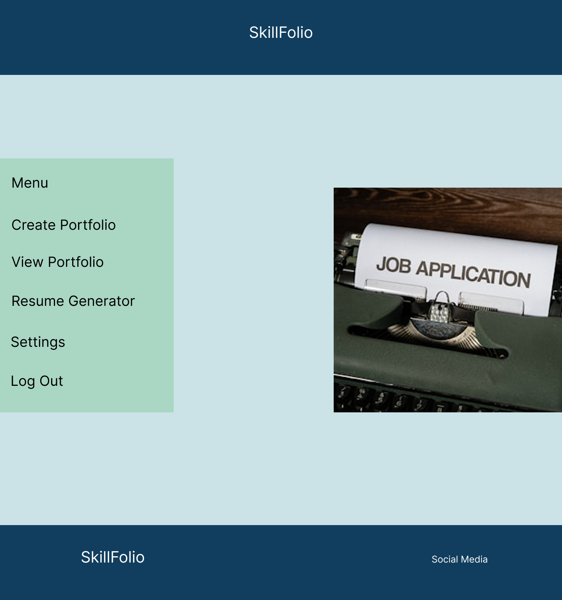
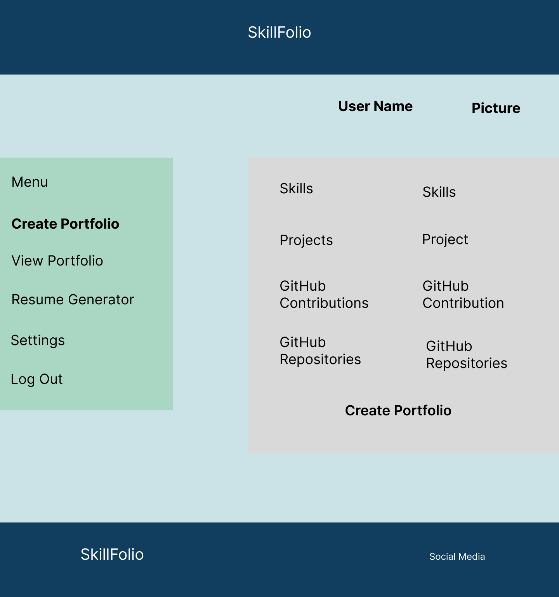
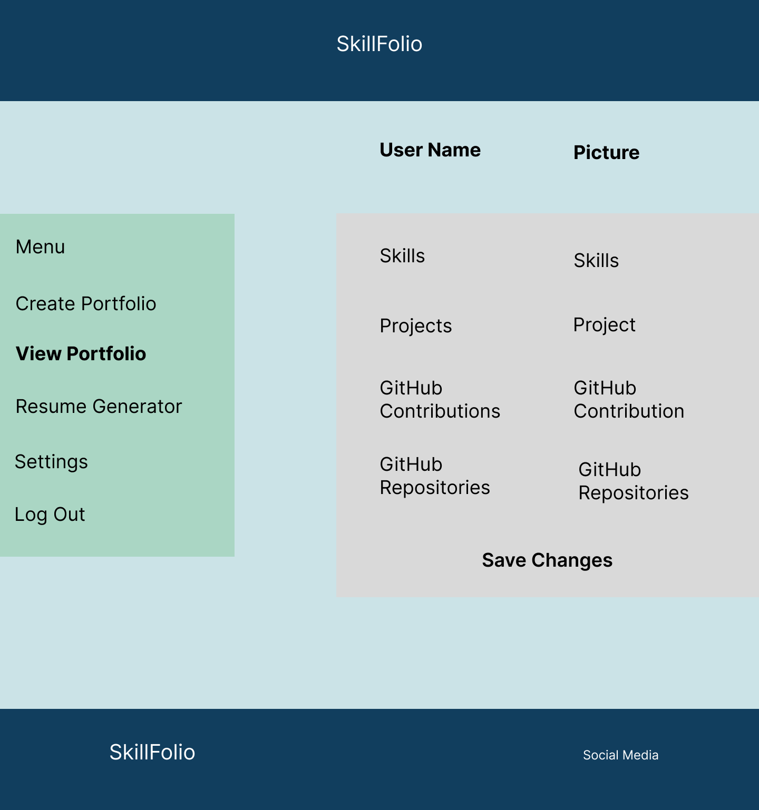
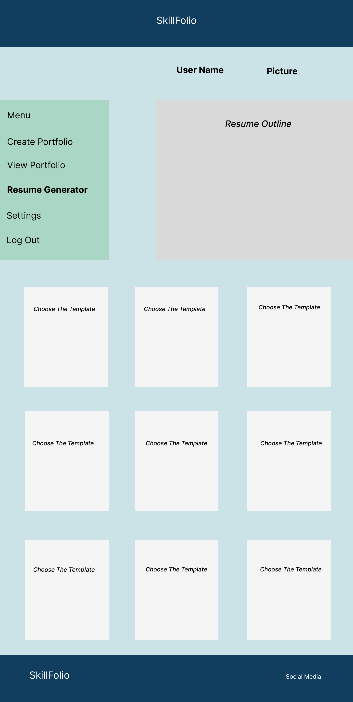

# Capstone Project Proposal

## Project Title: SkillFolio

### Overview

In today’s fast-paced tech industry, having a well-crafted portfolio and resume can be the key to unlocking new opportunities. However, many developers, especially those new to the field, struggle with creating a professional-looking portfolio that effectively showcases their skills and projects. SkillFolio aims to bridge this gap by providing an intuitive, web-based platform that automates the creation of personalized portfolios and resumes, helping developers put their best foot forward with minimal effort.

### Problem Space

Developers, especially new or aspiring ones, often struggle to create a compelling portfolio and resume that effectively showcase their skills and projects. Manually crafting a portfolio can be time-consuming and challenging for those who are not designers. By providing an easy-to-use platform, this project helps users create a portfolio and resume quickly, giving them a polished look to impress potential employers and collaborators.

### User Profile

- **Developers**:
    - Looking to create or update their portfolios and resumes.
    - Interested in showcasing their projects and GitHub contributions.
    - Want a customizable, easy-to-use tool to manage their professional presence online.


### Features

- **User Input for Projects and Skills**
    - Users can input detailed information about their projects, including tech stack, descriptions, and GitHub repository links.

- **Auto-Generated Portfolio**
    - The platform automatically generates a professional portfolio based on the information provided by the user.

- **Resume Generation**
    - Users can generate a downloadable resume based on their profile and project information.

- **GitHub Integration**
    - The platform integrates with the user’s GitHub account to automatically pull in open-source contributions.

- **Customization Options**
    - Users have the ability to tweak and customize the design and layout of their portfolio to fit their style.

- **Sharing Capabilities**
    - Users can share their portfolio links and resumes directly from the platform.

## Implementation

### Tech Stack

- **Frontend**: React.js, HTML5, CSS/SCSS (for custom styling)
- **Backend**: Node.js with Express.js (API for portfolio generation and GitHub integration)
- **Database**: MySQL (for user profiles and project data storage)

### Libraries/Tools
- GitHub API (for fetching public repositories and contributions)
- jsPDF (for generating downloadable PDF resumes)
- React Router (for navigation)
- Axios (for API calls)
- **OpenAI API** (for generating descriptions and inferring languages)
- **JWT Authentication** (for secure user authentication and session management)
- **Knex.js** (for SQL query building and managing database interactions)

### APIs

- **GitHub API (Free and Open Source)**
    - To fetch user repositories and contributions automatically.
    - [GitHub API Documentation](https://docs.github.com/en/rest)

- **jsPDF (Free and Open Source)**
    - To generate downloadable resumes in PDF format.
    - [jsPDF Documentation](https://github.com/parallax/jsPDF)

- **OpenAI API (Free and Open Source)**
    - To generate descriptions and infer languages.
    - [OpenAI API Documentation](https://platform.openai.com/docs/api-reference)

- **JWT Authentication**
    - To secure user authentication and manage sessions.
    - [JWT Documentation](https://jwt.io/introduction/)

- **Optional Future APIs**:
    - LinkedIn API (To pull in user professional information, free for basic access)
    - Unsplash API (To fetch free images for portfolio headers or backgrounds, with a free tier)
    - [Unsplash API Documentation](https://unsplash.com/documentation)

### Sitemap

- **Home Page**
    - Introduction to the platform and call-to-action buttons to sign up/log in.

- **Create Portfolio**
    - Form to input project details, tech stack, and GitHub repo links.

- **View Portfolio**
    - Display the auto-generated portfolio with user projects and contributions.

- **Resume Generator**
    - Section for users to input resume data and generate a downloadable PDF resume.

- **Settings Page**
    - Customization options for portfolio layout and theme (colors, fonts, etc.).

- **Authentication Pages**
    - Register/Log In page for account creation and user management.

### Mockups

### Mockups
- **Register Page**:
  

- **Login Page**:
  

- **Home Page**: 
  

- **Create Portfolio Page**:
  

- **View Portfolio**: 
  

- **Resume Page**:
  


### Data

- **User Profile**: Username, email, password, GitHub username (for API integration).
- **Project Details**: Project name, description, tech stack, GitHub link.
- **Resume Details**: User information (name, contact, skills, job experience).

### Endpoints

**POST /users/register**

- Add a user account

Parameters:
- email: User's email
- password: User's provided password

Response:
```json
{
    "token": "<JWT_TOKEN>"
}
```

**POST /users/login**

- Login a user

Parameters:
- email: User's email
- password: User's provided password

Response:
```json
{
    "token": "<JWT_TOKEN>"
}
```

**POST /api/portfolio**

- Save user portfolio data

Parameters:
- userId: User ID
- portfolioData: JSON object containing portfolio details

Response:
```json
{
    "success": true,
    "message": "Portfolio saved successfully"
}
```

**GET /api/portfolio/:userId**

- Fetch user portfolio data

Parameters:
- userId: User ID

Response:
```json
{
    "userId": "123",
    "portfolioData": {
        "name": "John Doe",
        "projects": [
            {
                "name": "project1",
                "description": "A description of project1",
                "techStack": ["React", "Node.js"],
                "url": "https://github.com/johnDoe/project1"
            },
            ...
        ],
        "contributions": [
            {
                "repoName": "open-source-project",
                "contribution": "Fixed a bug in the authentication module"
            },
            ...
        ]
    }
}
```

**POST /api/resume**

- Generate downloadable resume

Parameters:
- userId: User ID
- resumeData: JSON object containing resume details

Response:
```json
{
    "success": true,
    "message": "Resume generated successfully",
    "resumeUrl": "https://example.com/resume/123.pdf"
}
```

### Auth
- JWT auth
    - Before adding auth, all API requests will be using a fake user with id 1
    - Added after core features have first been implemented
    - Store JWT in localStorage, remove when a user logs out
    - Add states for logged in showing different UI in places listed in mockups


## Roadmap

- **Create Client:**
    - Set up the React project with routes and boilerplate pages.

- **Create Server:**
    - Set up the Express project with routing and placeholder 200 responses.

- **Create Migrations:**
    - Define database schema and create migration files.

- **Deploy Projects:**
    - Deploy both client and server projects to ensure all commits are reflected in production.

- **Feature: Create Portfolio**
    - Implement the create portfolio page and form.
    - Create the `POST /api/portfolio` endpoint.

- **Feature: View Portfolio**
    - Implement the view portfolio page.
    - Create the `GET /api/portfolio/:userId` endpoint.

- **Feature: Edit Portfolio**
    - Implement the edit portfolio page and form.
    - Update the `POST /api/portfolio` endpoint.

- **Feature: Generate Resume**
    - Implement resume generation and PDF download functionality.
    - Create the `POST /api/resume` endpoint.

- **Feature: Register and Login**
    - Implement the register and login pages and forms.
    - Create the `POST /users/register` and `POST /users/login` endpoints.

- **Feature: GitHub Integration**
    - Implement GitHub OAuth and fetch user data.
    - Fetch user repositories and contributions from GitHub.

- **Feature: Customization Options**
    - Add customization options for portfolio layout and theme (colors, fonts, etc.).

- **Feature: Sharing Capabilities**
    - Implement functionality to share portfolio links and resumes directly from the platform.

- **Feature: Implement JWT Tokens**
    - **Server:**
        - Update expected requests and responses on protected endpoints.
    - **Client:**
        - Store JWT in local storage.
        - Include JWT in Axios calls.

- **Bug Fixes:**
    - Iterate and fix any issues found during development and testing.

- **DEMO DAY:**
    - Prepare and present the project.

## Future Implementations
- **LinkedIn API Integration**: To pull in professional data and recommendations.
- **Advanced Customization**: More themes and layouts for portfolios.
- **Skills Section**: Add an interactive skills graph based on the user’s projects.

### Submission
**Due Date**: 2025-03-10  
**Submitted By**: Khushbu Shukla  
**GitHub Username**: KhushbuShukla008